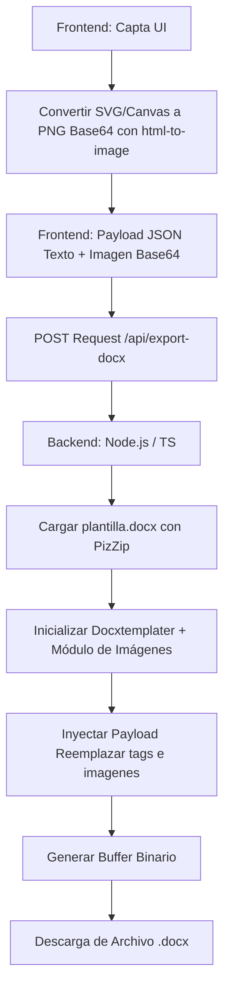

# Implementación de Exportación de Sesiones a Word (.docx)

Este documento detalla el flujo de trabajo, dependencias y código necesario para exportar la sesión de aprendizaje a un archivo de Word (`.docx`), incluyendo texto formateado y gráficos vectoriales generados.

## 1. Flujo de Trabajo



## 2. Requisitos Previos e Instalación de Dependencias

### En el Frontend
Para capturar los componentes vectoriales o gráficos generados por la IA:
```bash
npm install html-to-image
```

### En el Backend
```bash
npm install pizzip docxtemplater docxtemplater-image-module-free
npm install --save-dev @types/node
```

## 3. Configuración de la Plantilla de Word (`plantilla.docx`)

Crea un archivo llamado `plantilla.docx` usando Microsoft Word. Diseña el encabezado, pie de página, tipografía corporativa y tablas estáticas. En los lugares donde la IA o la sesión del usuario deban insertar información, escribe los siguientes tags:

- **Texto Simple**: `{{nombre_usuario}}` o `{{fecha}}`
- **Bloques de Texto Largo / Saltos de Línea**: `{{contenido_ia}}`
- **Imágenes / Gráficos Vectoriales**: `{%grafico_sesion}` *(Nota el prefijo `%` requerido por el módulo de imágenes)*

> [!IMPORTANT]
> Asegúrate de que los caracteres `{` y `}` no tengan formatos internos fragmentados en Word. Si experimentas errores de renderizado, borra el tag por completo y vuelve a escribirlo sin pausar ni cambiar de formato.

## 4. Implementación en el Frontend (TypeScript/JavaScript)

El frontend debe recopilar los textos de la sesión de IA y capturar los contenedores de gráficos vectoriales (como charts de Recharts, Chart.js o SVGs crudos) convirtiéndolos a imágenes PNG en formato string Base64.

```typescript
import { toPng } from 'html-to-image';

interface ExportPayload {
  nombre_usuario: string;
  fecha: string;
  contenido_ia: string;
  grafico_sesion: string; // Contendrá el string DataURL (Base64)
}

async function exportarSesionAWord() {
  const nodeGrafico = document.getElementById('contenedor-vectorial-grafico');
  
  if (!nodeGrafico) {
    console.error('No se encontró el elemento del gráfico');
    return;
  }

  try {
    // 1. Convertir el elemento vectorial (SVG/Canvas/HTML) a un PNG Base64
    // Se recomienda un dataUrl con fondo blanco para que resalte bien en Word
    const dataUrlPng = await toPng(nodeGrafico, { 
      backgroundColor: '#ffffff',
      pixelRatio: 2 // Mejora la resolución/claridad en la impresión del Word
    });

    // 2. Construir el Payload con la información recopilada
    const payload: ExportPayload = {
      nombre_usuario: "Samuel Yulino",
      fecha: new Date().toLocaleDateString('es-PE'),
      contenido_ia: "El análisis cuantitativo de la red neuronal indica una convergencia óptima en el ciclo actual...",
      grafico_sesion: dataUrlPng // Formato: data:image/png;base64,iVBORw0KGgoAAA...
    };

    // 3. Enviar al Backend
    const response = await fetch('/api/export-docx', {
      method: 'POST',
      headers: {
        'Content-Type': 'application/json',
      },
      body: JSON.stringify(payload),
    });

    if (!response.ok) throw new Error('Error al generar el documento en el servidor');

    // 4. Descargar el archivo binario recibido
    const blob = await response.blob();
    const url = window.URL.createObjectURL(blob);
    const a = document.createElement('a');
    a.href = url;
    a.download = `Reporte_Sesion_${Date.now()}.docx`;
    document.body.appendChild(a);
    a.click();
    document.body.removeChild(a);
    window.URL.revokeObjectURL(url);

  } catch (error) {
    console.error('Error en el proceso de exportación:', error);
  }
}
```

## 5. Implementación en el Backend (Node.js + TypeScript)

Este controlador recibe el JSON, procesa la imagen en Base64 convirtiéndola en un Buffer binario compatible, inicializa `docxtemplater` junto con el módulo de imágenes, y procesa la plantilla OpenXML.

```typescript
import { Request, Response } from 'express';
import fs from 'fs';
import path from 'path';
import PizZip from 'pizzip';
import Docxtemplater from 'docxtemplater';

// Importación del módulo de imágenes (compatible con ES Modules / CommonJS)
const ImageModule = require('docxtemplater-image-module-free');

export const handleExportDocx = async (req: Request, res: Response): Promise<void> => {
  try {
    const { nombre_usuario, fecha, contenido_ia, grafico_sesion } = req.body;

    // 1. Cargar el archivo de la plantilla física (.docx)
    const templatePath = path.resolve(__dirname, '../../templates/plantilla.docx');
    const content = fs.readFileSync(templatePath, 'binary');
    const zip = new PizZip(content);

    // 2. Configurar las opciones del Módulo de Imágenes
    const imageOptions = {
      centered: true, // Centrar automáticamente las imágenes insertadas
      getImage: (tagValue: string) => {
        // El tagValue recibe el string Base64 puro enviado desde el front.
        // Removemos el prefijo dataurl si existe
        const base64Data = tagValue.replace(/^data:image\/png;base64,/, "");
        return Buffer.from(base64Data, 'base64');
      },
      getSize: (imgBuffer: Buffer, tagValue: string, tagName: string) => {
        // Definir dimensiones de la imagen en el documento Word (en píxeles)
        // Se puede personalizar según el identificador de la etiqueta (tagName)
        if (tagName === 'grafico_sesion') {
          return [600, 320]; // [Ancho, Alto] aproximado para un gráfico estándar
        }
        return [150, 150]; // Tamaño por defecto
      }
    };

    // 3. Inicializar Docxtemplater con soporte para párrafos y el módulo de imágenes
    const doc = new Docxtemplater(zip, {
      paragraphLoop: true,
      linebreaks: true, // Crucial para respetar los saltos de línea (\n) del texto de la IA
      modules: [new ImageModule(imageOptions)]
    });

    // 4. Inyectar la información al contexto de la plantilla
    doc.setData({
      nombre_usuario,
      fecha,
      contenido_ia,
      grafico_sesion // Este tag mapea directo al {%grafico_sesion} en el .docx
    });

    // 5. Compilar el documento
    doc.render();

    // 6. Generar el archivo resultante en un Buffer de Node.js
    const outputBuffer = doc.getZip().generate({
      type: 'nodebuffer',
      compression: 'DEFLATE' // Comprime el zip interno del OpenXML
    });

    // 7. Configurar Headers HTTP para descarga de archivos binarios sin almacenamiento físico en disco
    res.setHeader('Content-Type', 'application/vnd.openxmlformats-officedocument.wordprocessingml.document');
    res.setHeader('Content-Disposition', `attachment; filename=Reporte_IA.docx`);
    res.send(outputBuffer);

  } catch (error: any) {
    console.error('Error del Servidor al compilar Docx:', error);
    res.status(500).json({ 
      success: false, 
      message: 'Error interno al generar el documento de Word.',
      error: error.message 
    });
  }
};
```

## 6. Consideraciones Críticas y Formateo del Texto de la IA

Las Inteligencias Artificiales suelen responder usando sintaxis Markdown (ej. texto en negrita, `# Títulos`, listas con `-`). `docxtemplater` básico inyectará estos strings de manera literal, mostrando los asteriscos directamente en el archivo Word.

Para solventar este problema y lograr un acabado óptimo, considera aplicar una de las siguientes soluciones:

1. **Limpieza Previa (Regex)**: Si solo deseas texto plano limpio, pasa el contenido de la IA por una función limpiadora antes de enviarlo al backend para eliminar los tokens de Markdown.
2. **Traducción de Sub-párrafos (Avanzado)**: Si necesitas conservar negritas, puedes estructurar el JSON en forma de arreglos de líneas con propiedades booleanas (ej. `[{ text: "Hola", bold: true }, { text: " mundo", bold: false }]`) y usar bucles nativos de la librería en Word mediante tags estructurados:
   ```text
   {#contenido_estructurado}{{text}}{/contenido_estructurado}
   ```
3. **Habilitar Saltos de Línea**: Asegúrate de mapear los caracteres `\n` devueltos por el proveedor de IA. La opción `linebreaks: true` configurada en la inicialización del backend garantiza que cada salto de línea en la respuesta de la IA se traduzca correctamente a un salto de párrafo OpenXML (`w:br` / `w:p`).
